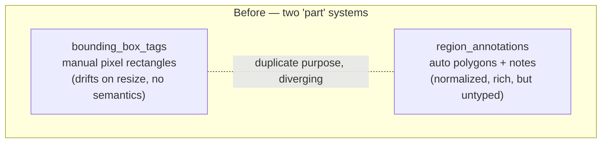
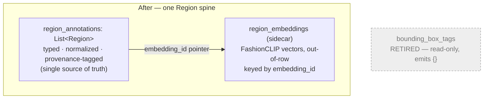
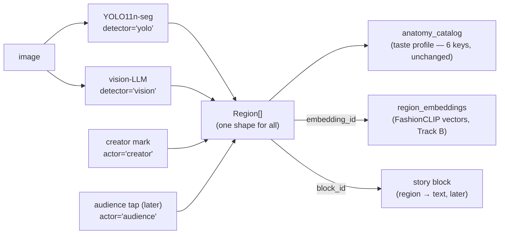

# Study: Track A — the data-model unification (worked example)

A guided read of the first backend change, so you can (a) understand what shipped, (b) see how it serves the purpose, and (c) know how to verify it. Use this as the template for studying later track builds.

Shipped on `feat/vision-pipeline`: commits `7cc2757` (sidecar), `153d469` (Region model), `05f8509` (verification). Backend-only; no frontend touched.

---

## 1. In one sentence
Two separate, incompatible ways of "marking a part of an image" were merged into **one** typed data model (`Region`), and the old one was retired safely — giving every future track a single, truthful place to read and write image parts.

---

## 2. Before → after (the structural change)

**Before — two disconnected systems doing the same job:**

**After — one model, plus a sidecar for heavy vectors:**

The old `bounding_box_tags` isn't deleted (that would break readers) — it's a **deprecation shim**: still readable, emits `{}`, no new writes, gone after one release.

---

## 3. The data flow (how a region is born and used)

Read it as: **many producers, one shape, three consumers.** YOLO, the vision-LLM, creators, and (later) audiences all write the *same* `Region`; the catalog, the vector store, and the story link all read it. That convergence is the whole point of Track A.

---

## 4. The `Region` schema, grouped (what each part is for)

From `backend/schemas/post.py` (shipped). The fields cluster into seven jobs:

| Group | Fields | Why it exists |
|---|---|---|
| **Provenance** | `actor` (auto/creator/audience), `detector` (yolo/fashionpedia/sam2/vision) | The two-sided switch: tells a creator's deliberate mark from a one-tap audience signal from a machine detection. |
| **Geometry** | `box` (normalized x/y/w/h), `polygon`, `confidence` | Where the part is — as *fractions*, so it survives resize (fixed a real drift bug). |
| **Semantics** | `label`, `category`, `material`, `description` | What the part is. `label/category/material` are **catalog-critical** — kept verbatim so the taste catalog doesn't break. |
| **Fashion graph** | `part`, `attributes[]` | Fashionpedia's part-slot + 294-attribute vocab. Empty now; Track B fills them. |
| **Taste vector** | `embedding_id` | A *pointer* to the FashionCLIP vector in the sidecar — not the vector itself. |
| **Hierarchy** | `depth` (0 whole / 1 fine), `parent_id` | Links a fine part (a cuff) to its anchor (a jacket). |
| **Curator meaning** | `prioritised`, `weight`, `user_note` | The "how it affects me" — also catalog-critical. |
| **Cross-link** | `block_id` | Optional region→story-paragraph link, wired later. |

Two design moves worth internalizing (they recur):
- **`model_config = ConfigDict(extra="allow")`** — strict validation, but unknown keys are tolerated. So Track B can start emitting new fields before the schema formally names them. Forward-compatibility on purpose.
- **Additive + null-safe** — every new field defaults to empty/None, so the 269 existing regions stayed valid with no migration. *Adding capability without a rewrite* is the skill here.

---

## 5. Why this serves the purpose (not just tidiness)

- **One truthful spine so the tracks don't diverge.** B (segmentation), C (reading), D (UI), F (audience) now all build against *one* contract. Without A they'd each invent their own shape and never reconcile. This is the "Foundation" move.
- **Two-sided, ahead of the feature.** `actor` + `embedding_id` + `part/attributes[]` mean the audience side and the taste-vector layer *plug in* later instead of forcing a schema rewrite. Cheap now, expensive if deferred.
- **Zero regression.** The six catalog keys were preserved exactly, so the taste catalog (`anatomy_catalog_service`) needed no query change — proven, not assumed (143 buckets identical before/after).
- **A real bug fixed for free.** Normalized coordinates removed the manual-mark pixel-drift that the resizable pane had made reachable.

---

## 6. Code references (read these, in this order)
1. `backend/schemas/post.py` — `Region` + `RegionBox` (the contract). Start here.
2. `backend/services/region_embedding_service.py` — the sidecar stub (where vectors will land).
3. `backend/database.py` — the `region_embeddings` collection.
4. `backend/services/segmentation_service.py` — sets `detector="yolo"`.
5. `backend/services/vision_service.py` — sets `detector="vision"`; fine parts get `parent_id`.
6. `backend/routers/posts.py` — `detect-regions` (defaults + preserves curator fields by id) and `region-annotations` (validates against `Region`).

To read any of these without switching branches: `git show feat/vision-pipeline:backend/schemas/post.py`.

---

## 7. Verify it yourself (the evidence, reproduced)
- **See the contract:** `git show feat/vision-pipeline:backend/schemas/post.py | sed -n '30,66p'`.
- **See the verification the session ran:** `git show feat/vision-pipeline:05f8509` (the script + what it checked).
- **The three claims to confirm:** (1) all 269 live regions parse as `Region`; (2) `aggregate_categories` returns the same 143 buckets before/after; (3) a save→detect round-trip keeps `actor/detector/parent_id` correct and `bounding_box_tags` reads `{}`.
- **The honest flag to remember:** the "0 rows" premise was actually **1 stray row** (`post 6a37fb23…`, a test tag). Left inert and read-safe. This is the kind of drift you want sessions to surface, not hide.

---

## 8. What it unblocks
Track B fills `embedding_id` (via the sidecar), `part`, and `attributes[]`, and adds `detector="fashionpedia"/"sam2"`. Track C reads the embeddings for RAG. Track D renders the unified `Region[]` in the Visual pane. The contract and the vector write-path are both in place for them.
