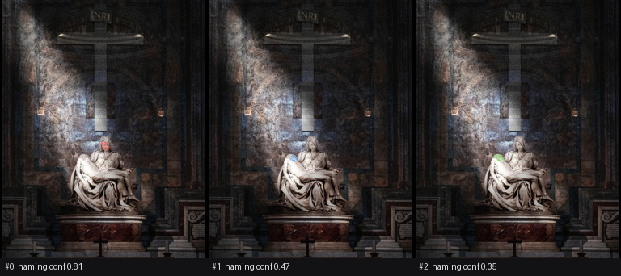

# Review — `sam3-face-control`

*A concept anyone can check by eye · mode `organ_direct` · locked to `concept_segment` · expected `positive`*

> The floor of the matrix. `face` on a fixture containing two of them (Mary's, tilted down; Christ's, fallen back) is the one run where a reviewer needs no expertise and no gold mask to say whether the organ was right. Every harder phrase in this lab is read against it: if `face` fails here, nothing else in the matrix says anything about phrases at all, because the organ itself is not working on this picture.
It also probes the plural claim. Two faces are visibly present, so `instance_count` is checkable rather than merely plausible.


## What was asked

| | |
|---|---|
| prompt | — |
| control phrase | `face` |
| phrase actually used | `face` |
| phrase source | control |
| planner | — (not_applicable) |
| image | `research/rehearsals/fixtures/002F-pieta-single-object/pieta-in-situ.jpg` |

## What the harness measured

| | |
|---|---|
| availability | available |
| device / model | mps / facebook/sam3 |
| invocations | 1 of budget 1 |
| lock held | yes |
| cold / warm | cold |
| latency | 1.399e+04 ms (load 2.1 ms) |
| organ status | **ok** |
| instances | 3 |
| mask areas (px) | 338, 172, 302 |
| max pairwise IoU | 0.539 |
| all masks well-formed | yes |
| invariants held | yes |

## Attribution

**organ_succeeded** — the organ measured 3 instance(s) of 'face'. Whether those instances ARE that concept is not established here

Harness: **clean**. Semantic correctness: **not_established**.

> Nothing above establishes that a mask is of the thing the words named. A confidence, a plausible area and a well-formed RLE are all compatible with a mask of the background — SF-004-R2 measured exactly that. That question is settled below, by a person, or not at all.




## Manual review — TO BE FILLED IN

- protocol: **human_visual**  ·  gold mask present: **no**  ·  status: **pending**

- [ ] Two faces are visible. How many did it return, and are they the faces?
      > 
- [ ] Did it mask any of the painted figures in the apse behind the sculpture?
      > 

```text
concept_binding :          # correct | partial | misbound | ambiguous | absent
coverage        :          # all_instances | some_instances | none | not_applicable
boundary_quality:          # clean | loose | wrong
false_positives :
false_negatives :
empty_means     :          # true_absence | missed_detection | undetermined
reviewer        :
reviewed_at     :
notes           :
```

When filled in, copy these into `score.json` under `review`, set `review.status` to `complete`, and set `verdict.semantic_correctness` to `established_by_review` or `refuted_by_review`. The harness will never write those fields itself.
